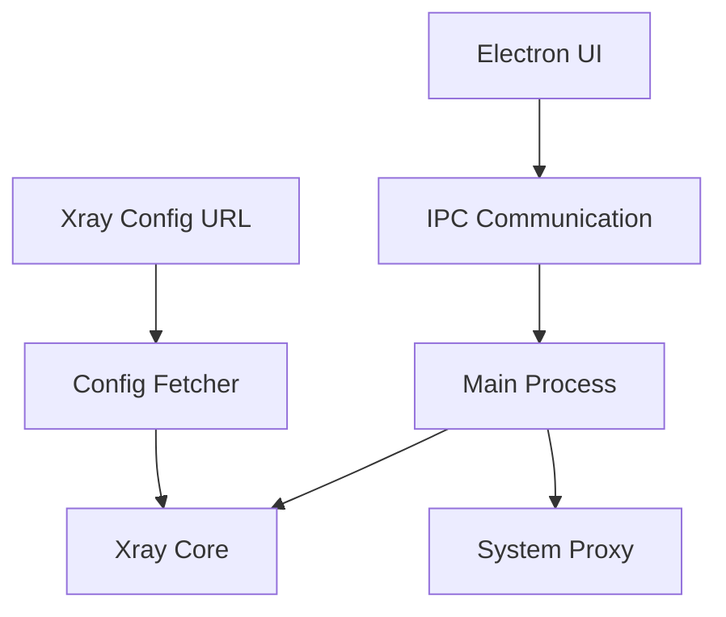

# DengVPN

<p align="center">
  
</p>

<p align="center">
  <strong>Free & Unlimited VPN Service</strong>
</p>

<p align="center">
  <a href="https://github.com/code3-dev/dengvpn/releases">
    
  </a>
  <a href="https://github.com/code3-dev/dengvpn/blob/master/LICENSE">
    
  </a>
  <a href="https://github.com/code3-dev/dengvpn/issues">
    
  </a>
</p>

---

## 🌐 Free, Unlimited Desktop VPN Client

DengVPN is a powerful, free, and unlimited bandwidth desktop VPN client powered by [Xray](https://github.com/XTLS/Xray-core) core and built with Electron. Enjoy secure and unrestricted internet access without any data limits.

### ✨ Key Features

- ✅ **100% Free & Unlimited** bandwidth
- 🔄 **Auto-fetches** updated Xeay configurations
- 🖱️ **One-click** connect/disconnect
- ⚙️ **Automatically configures** system proxy (Windows & Linux)
- 📊 **Real-time connection stats** (ping, uptime)
- 🔁 **Auto-restart** on disconnection
- 🛡️ **Secure** with Xray core protocol
- 🖥️ **Cross-platform** support (Windows & Linux)

---

## 📚 Documentation

- [User Guide](docs/user-guide.md) - Instructions for installing and using DengVPN
- [Technical Documentation](docs/) - Detailed information about the core architecture
- [Development Guide](docs/development.md) - Setting up a development environment
- [FAQ](docs/user-guide.md#faq) - Frequently asked questions

---

## 🚀 Quick Start

### Installation

#### Windows
1. Download the latest release from [GitHub Releases](https://github.com/code3-dev/dengvpn/releases)
2. Run the installer (`DengVPN-{version}-x64.exe`)
3. Launch DengVPN from your desktop or start menu

#### Linux
1. Download the AppImage or deb package from [GitHub Releases](https://github.com/code3-dev/dengvpn/releases)
2. Make the AppImage executable: `chmod +x DengVPN-{version}-x86_64.AppImage`
3. Run the AppImage: `./DengVPN-{version}-x86_64.AppImage`

### Usage

1. Click **Connect** to establish a VPN connection
2. View real-time connection stats in the dashboard
3. Click **Disconnect** to terminate the connection

---

## 🏗️ Architecture



### Core Components

- **Frontend Layer**: Electron-based UI for intuitive user interaction
- **IPC Layer**: Secure bidirectional communication between renderer and main process
- **Core Engine**: [Xray](https://github.com/XTLS/Xray-core) binary for robust VPN protocol handling
- **Configuration Tool**: [x2j](https://github.com/code3-dev/x2j) for converting Xray links to Xray JSON configs
- **System Integration**: Uses platform-specific scripts to modify system proxy settings

---

## 🔧 Technical Details

### Core Technologies

- **Framework**: [Electron](https://www.electronjs.org/) v34.0.2
- **VPN Core**: [Xray Core](https://github.com/XTLS/Xray-core)
- **Config Tool**: [x2j](https://github.com/code3-dev/x2j)
- **Language**: JavaScript (CommonJS)
- **HTTP Client**: Axios v1.8.4
- **Build Tool**: electron-builder v26.0.12

### Project Structure

```
dengvpn/
├── assets/           # HTML templates and icons
├── core/             # Xray binaries, config files, and platform scripts
│   ├── configs/      # Generated JSON configuration files
│   ├── linux/        # Linux-specific binaries and scripts
│   │   ├── xray/     # Xray core binaries for Linux
│   │   └── x2j/      # x2j conversion tool for Linux
│   ├── xray/         # Windows Xray core binaries
│   ├── x2j/          # Windows x2j conversion tool
│   ├── run.bat       # Windows Xray execution script
│   ├── run.sh        # Linux Xray execution script
│   ├── disable_proxy.bat  # Windows proxy disabling script
│   └── disable_proxy.sh   # Linux proxy disabling script
├── dist/             # Compiled frontend assets
├── docs/             # Complete documentation
├── release/          # Generated installers
├── loader.js         # Application entry point
├── main.js           # Main Electron process logic
├── preload.js        # Secure IPC preloading
├── verify-core.js    # Core components validator
└── obfuscate.js      # Code protection utility
```

### Core Workflow

1. Application fetches Xray configuration URL
2. [x2j](https://github.com/code3-dev/x2j) converts Xray Links to Xray JSON config
3. [Xray](https://github.com/XTLS/Xray-core) core executes with generated config
4. System proxy automatically configured via platform-specific scripts
5. Real-time stats displayed in UI via IPC communication

---

## 🛠️ Development

### Prerequisites

- Node.js 22
- npm 10+

### Setup

```bash
# Clone the repository
git clone https://github.com/code3-dev/dengvpn.git
cd dengvpn

# Install dependencies
pnpm install

# Start development mode
pnpm start
```

### Build Commands

```bash
# Verify core components
pnpm verify-core

# Obfuscate source code
pnpm obfuscate

# Build for Windows
pnpm build:win

# Build for Linux
pnpm build:linux

# Full production build
pnpm build
```

## 🔐 Security

DengVPN is designed with security in mind:

- Uses industry-standard Xray core protocol
- Automatic system proxy configuration
- No data collection or telemetry
- Open-source for community review

---

## 📦 Release Process

1. Code is automatically built using GitHub Actions
2. Platform-specific installers are generated with electron-builder
3. Release is published to GitHub Releases
4. Installers are available for both Windows and Linux

---

## 🤝 Contributing

Contributions are welcome! Please feel free to submit a Pull Request.

1. Fork the repository
2. Create your feature branch (`git checkout -b feature/AmazingFeature`)
3. Commit your changes (`git commit -m 'Add some AmazingFeature'`)
4. Push to the branch (`git push origin feature/AmazingFeature`)
5. Open a Pull Request

---

## 📄 License

This project is licensed under the MIT License - see the [LICENSE](LICENSE) file for details.

---

## 🙏 Acknowledgments

- [Xray Core](https://github.com/XTLS/Xray-core) - The core VPN protocol implementation
- [x2j](https://github.com/code3-dev/x2j) - Xray to JSON configuration converter
- [Electron](https://www.electronjs.org/) - Cross-platform desktop application framework
- All contributors who have helped with testing and development

---

<p align="center">
  Made with ❤️ by <a href="https://github.com/code3-dev">Hossein Pira</a>
</p>