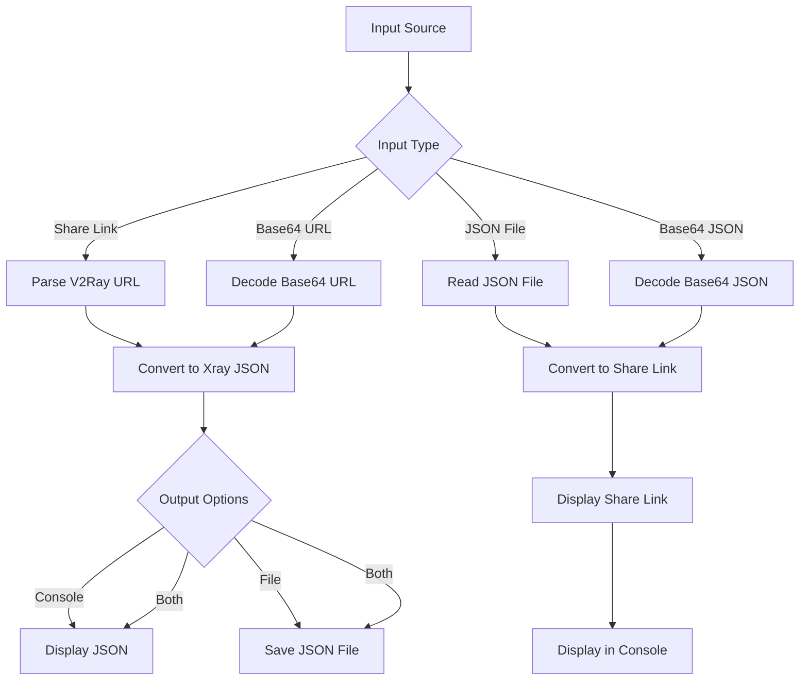

# x2j - Xray to JSON Converter

A command-line tool written in Go that converts V2Ray share links (VMess, VLess, ShadowSocks, Trojan) to Xray JSON configuration files and vice versa.

## 🚀 Features

- Supports all major V2Ray protocols:
  - VMess
  - VLess
  - Shadowsocks
  - Trojan
- Bidirectional conversion:
  - Share links → Xray JSON
  - Xray JSON → Share links
- Cross-platform compatibility (Windows, macOS, Linux, Android, iOS)
- Multiple output options:
  - Console output
  - JSON file output (URL to JSON only)
  - Combined console and file output (URL to JSON only)
- Customizable inbound port and DNS servers

## 🛠️ Installation

1. Install Go 1.25.0 or later
2. Clone this repository
   ```bash
   git clone https://github.com/code3-dev/x2j.git
   cd x2j
   ```
3. Build the tool:
   ```bash
   go mod tidy
   go build -o x2j .
   ```

## 📋 Command Line Flags

| Flag | Description | Input Type | Platforms | Output Options |
|------|-------------|------------|-----------|----------------|
| `-u` | V2Ray share link to convert to JSON | URL string | All | Console, File, Both |
| `-j` | JSON file to convert to share link | File path | Desktop only | Console only |
| `-jb64` | Base64-encoded JSON to convert to share link | Base64 string | Desktop only | Console only |
| `-ub64` | Base64-encoded URL to convert to JSON | Base64 string | Desktop only | Console, File, Both |
| `-o` | Output JSON file path | File path | All | N/A (applies to URL to JSON) |
| `-c` | Show output in console | Flag | All | N/A |
| `-p` | Custom inbound port (default: 1080) | Integer | All | N/A |
| `-d` | Custom DNS servers | Comma-separated IPs | All | N/A |
| `-r` | Remarks/Comments for configuration | String | All | N/A |
| `-h` | Show help message | Flag | All | N/A |
| `--help` | Show help message | Flag | All | N/A |

## 🎯 Usage Examples

### Share Link to JSON Conversion

```bash
# Convert share link to JSON and display in console
./x2j -u "vmess://..."

# Convert share link to JSON file
./x2j -u "vmess://..." -o config.json

# Convert share link to JSON file and display in console
./x2j -u "vmess://..." -o config.json -c
```

### JSON to Share Link Conversion (Desktop only)

```bash
# Convert JSON file to share link (output to console only)
./x2j -j config.json

# Convert base64-encoded JSON to share link (output to console only)
./x2j -jb64 "base64_encoded_json_string"

# Convert base64-encoded URL to JSON
./x2j -ub64 "base64_encoded_url_string"

# Convert base64-encoded URL to JSON file
./x2j -ub64 "base64_encoded_url_string" -o config.json
```

### Advanced Options

```bash
# Set custom inbound port
./x2j -u "vmess://..." -p 10809

# Set custom DNS servers
./x2j -u "vmess://..." -d "1.1.1.1, 1.0.0.1"

# Add remarks to configuration
./x2j -u "vmess://..." -r "My Proxy Configuration"

# Combine multiple options
./x2j -u "vmess://..." -o config.json -p 10809 -d "1.1.1.1, 1.0.0.1" -r "Home Proxy" -c
```

### Help

```bash
# Show help message
./x2j -h
# or
./x2j --help
```

## 🔧 How It Works



## 🖥️ Cross-platform Support

The tool can be compiled for:
- Windows (.exe - x86 and x64)
- Windows (x86 and x64)
- macOS (Darwin)
- Linux
- Android (.aar library, .jar library)
- iOS (.xcframework)

Note: The JSON to URL conversion features (-j, -jb64) output to console only and are available only on desktop platforms (Windows, macOS, Linux).

## 📱 Mobile Platform Integration

For developers integrating x2j into mobile applications, check out our platform-specific integration guides:

- [Android Integration Guide](android/example) - Instructions for integrating the X2J Android library (AAR) into Android applications
- [iOS Integration Guide](ios/example) - Instructions for integrating the X2J iOS framework (XCFramework) into iOS applications

The mobile libraries are built using the [mobile.sh](mobile.sh) script which uses gomobile to create native libraries for each platform. The actual class and function names in the generated libraries follow gomobile's naming conventions based on the Go package and function names.

Note: 
- Go Mobile runs on the same architectures as Go, which currently means ARM, ARM64, 386 and amd64 devices and emulators. Notably, Android on MIPS devices is not yet supported.
- Target=ios requires the host machine to be running macOS.
- As of Go 1.5, only darwin/amd64 works on the iOS simulator.

## 📡 Supported Protocols

- **VMess**: Full support for all VMess configurations
- **VLess**: Full support including TLS, Reality, and various transport protocols
- **ShadowSocks**: Support for all ShadowSocks methods
- **Trojan**: Full support including TLS configurations

## 🌐 Supported Transport Protocols

- TCP
- WebSocket (WS)
- HTTP/2 (H2)
- mKCP
- QUIC
- gRPC
- XHTTP
- HTTPUpgrade

### Global Installation Setup

To make x2j accessible from any terminal/command prompt, use the platform-specific setup scripts in the `setup` directory:

#### Windows
```cmd
setup\windows_setup.bat
```
After running, you can use `x2j` from any command prompt.

#### macOS
```bash
chmod +x setup/macos_setup.sh
./setup/macos_setup.sh
```
After running, you can use `x2j` from any terminal.

#### Linux
```bash
chmod +x setup/linux_setup.sh
./setup/linux_setup.sh
```
After running, you can use `x2j` from any terminal.

These setup scripts will:
1. Check if Go is installed
2. Set up the Go environment
3. Build the application
4. Install it to your system PATH for global access

## 🏗️ Building for Different Platforms

### Windows Executable
```bash
# For x64
GOOS=windows GOARCH=amd64 go build -o x2j.exe .

# For x86
GOOS=windows GOARCH=386 go build -o x2j.exe .
```

### macOS
```bash
GOOS=darwin GOARCH=amd64 go build -o x2j .
```

### Linux
```bash
GOOS=linux GOARCH=amd64 go build -o x2j .
```

### Android
```bash
# Make sure gomobile is installed
# Requires Android SDK to be installed
./mobile.sh
# Select option 1 for Android library (AAR and JAR)
```

### iOS
```bash
# Make sure gomobile is installed
# Requires Xcode to be installed
./mobile.sh
# Select option 2 for iOS framework
```

## 📄 License

This project is licensed under the [GPL v3 License](LICENSE).